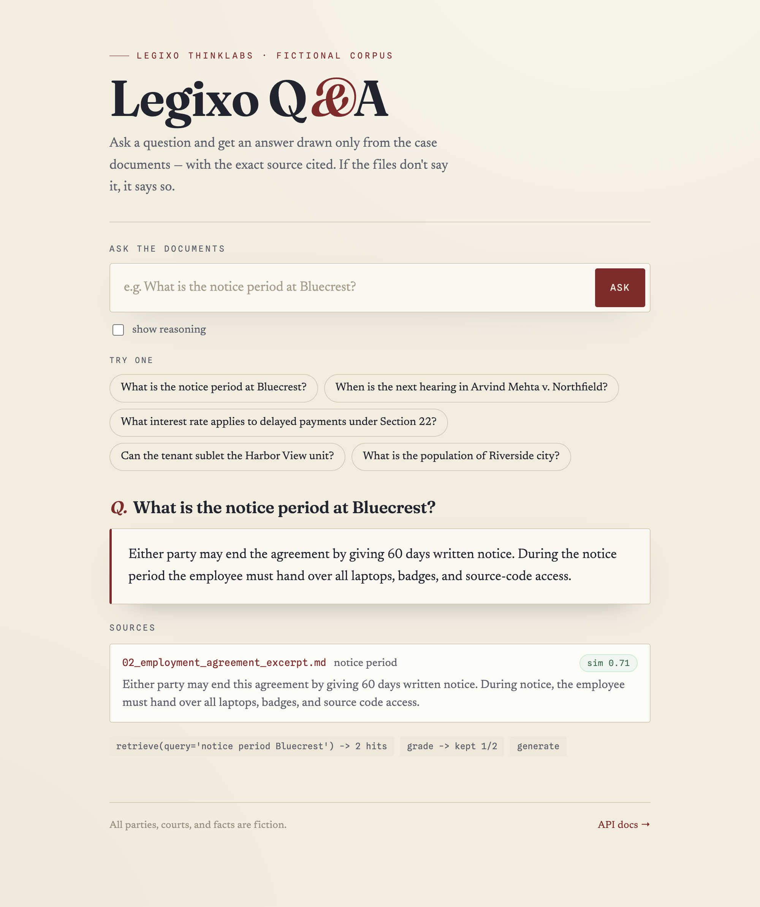

# Legixo Q&A API

A small HTTP API that answers questions **only** from a set of legal-style
documents. Each answer says which chunk it came from, and if the documents don't
contain the answer it says so instead of guessing.

Built with **Python · LangGraph · Pinecone · FastAPI**, on a fully free stack
(**Groq** for the answer LLM, **Gemini** for embeddings, **Pinecone** Starter for
the vector index — none require a credit card).

> The corpus in `corpus/` is fiction (made-up parties and courts) from the
> take-home brief.

---

## How it works

```
Ingest:  corpus/*.md -> chunk by section -> Gemini embeddings -> Pinecone (with metadata)

Ask:     POST /ask -> LangGraph: retrieve -> grade -> branch
                                   good     -> answer with citations
                                   bad      -> rewrite query, retry (bounded)
                                   exhausted -> "I cannot find this in the documents."
```

The graph, its branch, and the loop guard are documented in
[`docs/langgraph.md`](docs/langgraph.md).

---

## 1. Get the free API keys

| Service | Where | Env var |
|---------|-------|---------|
| Groq (answer LLM) | <https://console.groq.com> | `GROQ_API_KEY` |
| Google Gemini (embeddings) | <https://aistudio.google.com/apikey> — the free **AI Studio** key | `GEMINI_API_KEY` |
| Pinecone (vector DB) | <https://app.pinecone.io> | `PINECONE_API_KEY` |

## 2. Install

```bash
python3 -m venv .venv
source .venv/bin/activate          # Windows: .venv\Scripts\activate
pip install -r requirements.txt
```

Python 3.10+ (developed on 3.12/3.13).

## 3. Configure

```bash
cp .env.example .env
# edit .env and paste your three keys
```

## 4. Ingest the corpus into Pinecone

```bash
python -m app.ingest
```

This creates the Pinecone index on first run (serverless, AWS `us-east-1`,
dimension 768, cosine), chunks every `*.md` in `corpus/`, embeds them, and upserts
them with metadata. See the **Pinecone checklist** below.

## 5. Start the API

```bash
uvicorn app.main:app --reload
```

- **Web UI** — open <http://localhost:8000/> to ask questions in the browser.
- **Interactive API docs** — <http://localhost:8000/docs>.



## 6. Ask questions

A grounded answer with citations:

```bash
curl -s localhost:8000/ask -H 'content-type: application/json' \
  -d '{"question": "What is the notice period in the Bluecrest employment agreement?"}'
```
```json
{
  "answer": "Either party may end the agreement by giving 60 days written notice...",
  "citations": [
    { "source": "02_employment_agreement_excerpt.md",
      "chunk_id": "02_employment_agreement_excerpt#notice-period",
      "score": 0.71,
      "snippet": "Either party may end this agreement by giving 60 days written notice..." }
  ],
  "trace": null
}
```

A question the documents can't answer (note the empty `citations`):

```bash
curl -s localhost:8000/ask -H 'content-type: application/json' \
  -d '{"question": "What is the population of Riverside city?"}'
# -> {"answer": "I cannot find this in the documents.", "citations": [], "trace": null}
```

Add `?trace=true` to see the graph's node-by-node steps:

```bash
curl -s 'localhost:8000/ask?trace=true' -H 'content-type: application/json' \
  -d '{"question": "Can the tenant sublet the Harbor View unit?"}'
```

---

## Pinecone checklist

- **Create the index:** `python -m app.ingest` creates it automatically if missing
  (`dimension=768`, `metric=cosine`, `ServerlessSpec(cloud="aws", region="us-east-1")`).
  You can also create it manually in the Pinecone console with those settings.
- **Region:** the free Starter plan only allows **AWS `us-east-1`** — it is hardcoded.
- **Env vars:** `PINECONE_API_KEY` (required); optional `PINECONE_INDEX_NAME`,
  `PINECONE_NAMESPACE` — see `.env.example`.
- **Running ingest twice:** vector ids are the deterministic chunk ids
  (`<file>#<section>`), so a second run **overwrites the same ids — the vector count
  stays the same, no duplicates**. Unchanged chunks are skipped (a `content_hash` is
  stored in metadata). Use `python -m app.ingest --reset` to wipe the namespace and
  rebuild from scratch.
- **Note:** Starter indexes pause after ~3 weeks idle; re-run ingest to wake one.

---

## Self-test (eval)

`eval/sample_test_cases.json` holds the gold-set questions (16 in-corpus + 3
out-of-corpus). With the server running:

```bash
python eval/run_eval.py
```

It posts each question and reports **citation correctness**, **fact recall**, and
**abstain correctness**, writing per-question pass/fail to `eval/results.md`.

## Tests

```bash
pytest
```

Unit tests (chunking, grading, citation guard, routing) and an API test run fully
offline with mocked providers. `tests/test_integration.py` runs end-to-end and is
skipped unless API keys are set.

---

## Project layout

```
app/
  main.py        FastAPI app + /ask + /health + web UI at /
  static/        single-page chat UI (vanilla HTML/CSS/JS, no build step)
  graph.py       LangGraph: retrieve -> grade -> branch -> generate / refine / give up
  retrieval.py   embed query + Pinecone search + score floor
  llm.py         grounded answer, relevance grader, query rewrite, citation guard
  chunking.py    header-aware markdown splitter
  ingest.py      python -m app.ingest
  clients.py     Pinecone / Gemini / Groq constructors
  schemas.py     request/response models
  settings.py    config from .env
corpus/          the documents
eval/            gold-set questions + run_eval.py
docs/langgraph.md
```

## Configuration

All optional, via `.env` (defaults shown):

| Var | Default | Meaning |
|-----|---------|---------|
| `ANSWER_MODEL` | `llama-3.3-70b-versatile` | Groq chat model |
| `EMBED_MODEL` | `gemini-embedding-001` | Gemini embedding model |
| `TOP_K` | `4` | chunks retrieved per query |
| `SCORE_THRESHOLD` | `0.55` | cosine floor for a "good" chunk |
| `MAX_LOOPS` | `2` | query rewrites before giving up |

---

## Design notes

- **Grounding is enforced in code, not just by the prompt.** After the LLM answers,
  any citation whose chunk id was not actually retrieved is dropped; if nothing valid
  remains, the answer becomes the refusal. Fabricated citations cannot reach the
  response.
- **Chunking** is per `##` section, with the document title and front-matter
  prepended to each chunk — so a question about the rent *and* the parties can be
  answered (and cited) from a single lease chunk.
- **Embeddings** use Gemini at 768 dimensions, L2-normalised (the model doesn't
  normalise truncated outputs), matching a cosine Pinecone index.

## What I'd add with more time

- **Hybrid search** (dense + sparse) for exact-term legal lookups.
- **A reranker** (e.g. Pinecone `bge-reranker-v2-m3`) after retrieval to sharpen the
  good/bad gate.
- **LangSmith** tracing for richer observability of graph runs.

## Demo video

_(5–10 min walkthrough: install → ingest → start API → call /ask with a few good
answers and one unanswerable question → the LangGraph layout.)_ — **link to add.**
